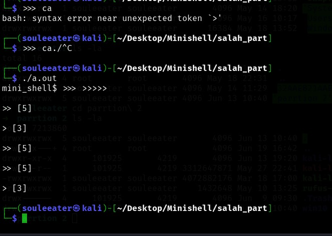
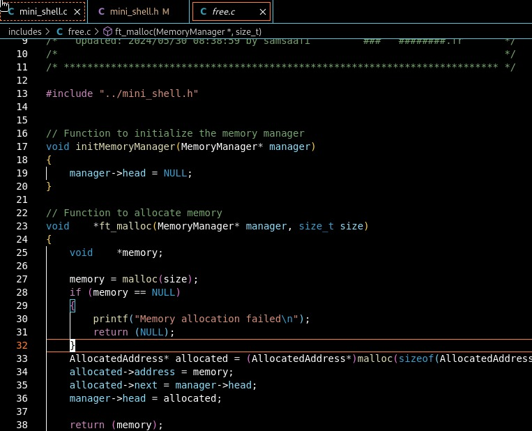

## Notes For Thing To Fix IN Our Parts In Minishell

> - ### first we need to handle three_redirection like in  the picture:

> - ### here we need to print all errror in StdError or create a function do this like give it a string and std where will write to

> -
